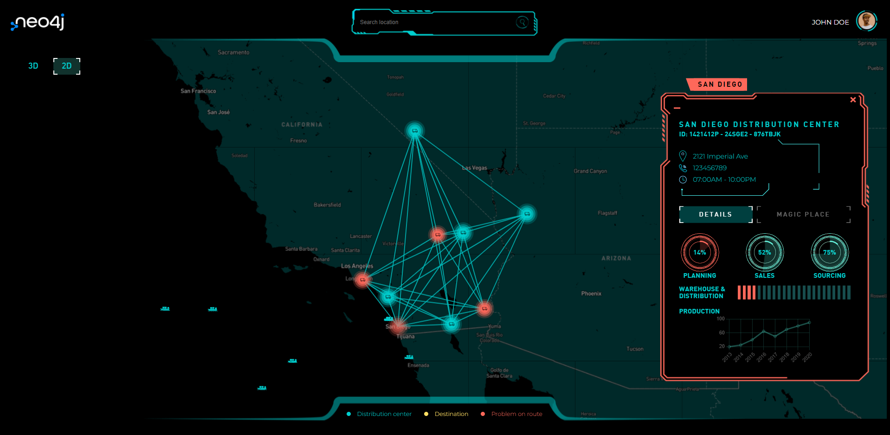
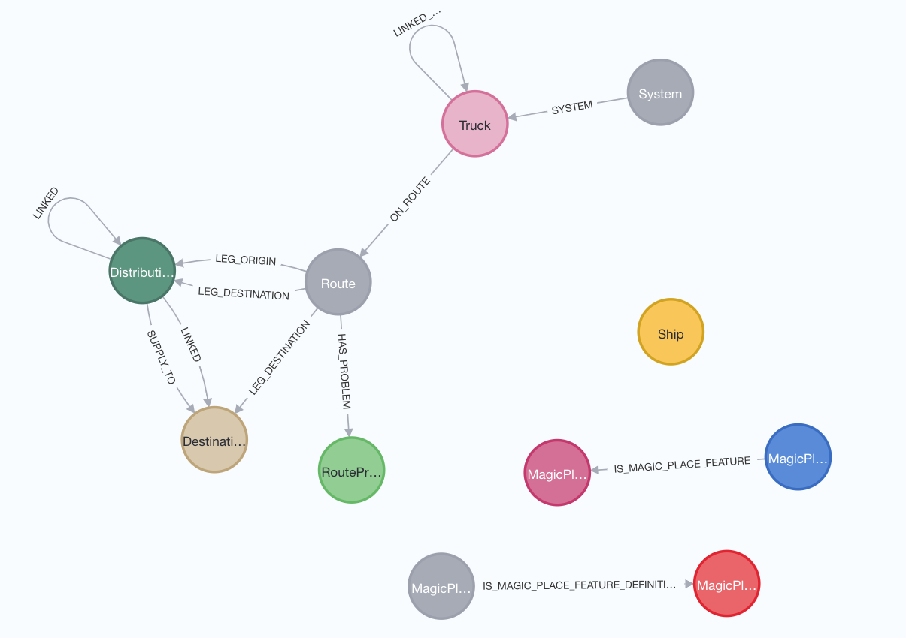
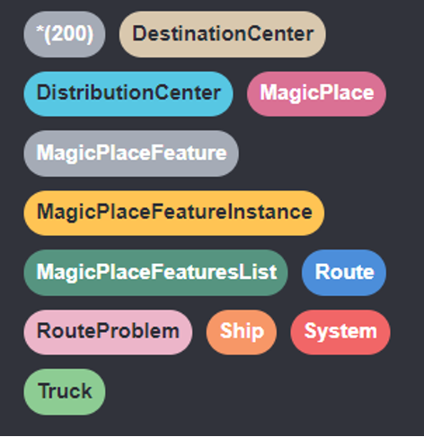
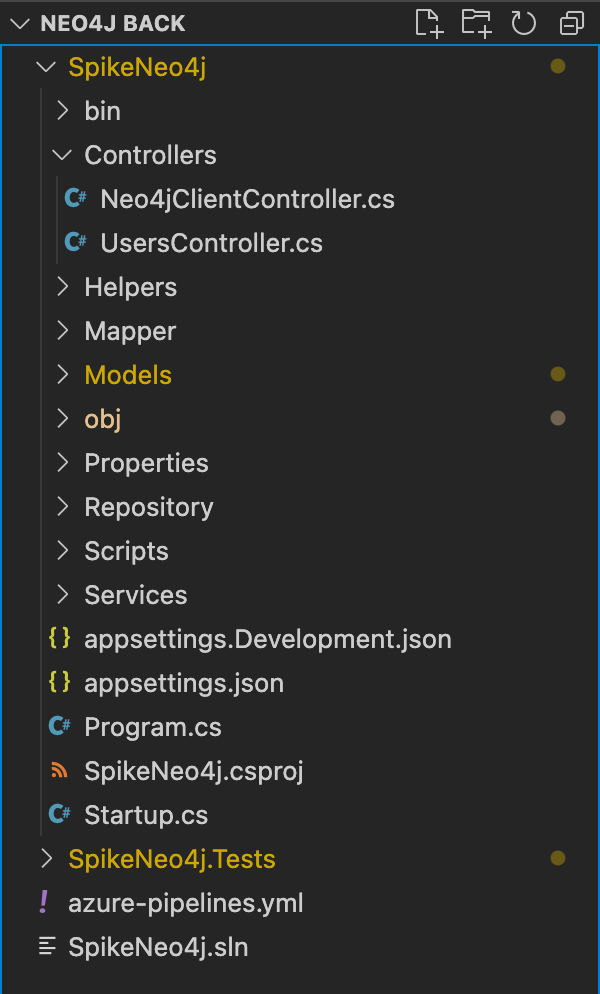
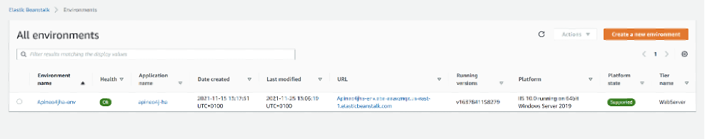
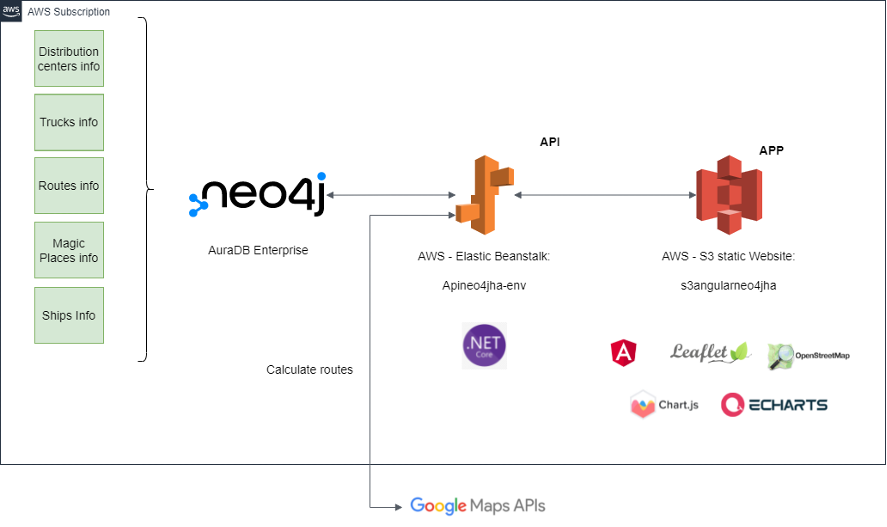

# Supply-Chain-Demo
Neo4j Supply Chain Application Demo

# Supply-Chain-Demo Overview Video
[](https://www.youtube.com/watch?v=m_r9ta5F4G0 "Neo4j Supply Chain Application Demo")

# Explainer Article

Here is a [more detailed article](https://neo4j.com/blog/demo-build-intelligent-supply-chain-app-neo4j/) that explains the Supply Chain application from a use-case perspective.

# Technical Documentation
Please Check Neo4j - Supply Chain Use Case - Technical Manual.docx

Or:

# Get Started

## Introduction

This document describes the technical characteristics of the Neo4J retail use case project - the **Supply Chain Demo**.

## Neo4j Database Model

Implemented model: 



### Start your free AuraDB instance

Register or Login your AuraDB account here: <https://dev.neo4j.com/aura>. Neo4j AuraDB is Neo4j’s fully managed cloud service. The zero-admin, always-on graph database for cloud developers.

We recommend to use AuraDB to learn the Supply Chain Demo.

You need your connection string and login info to connect from the backend service.

### Init Test Dataset:

When your AuraDB instance is running. You can use Neo4j Browser to run the Cypher script to init the test dataset. The script file is located at `DBScripts/populateDB.txt`.

Test data size:



## Backend API

The backend API built using .NET 5.0. The solution contains two projects: 

- `SpikeNeo4j`: API implementation.

- `SpikeNeo4j.Tests`: Unit tests for the controllers.

To connect to the Neo4j database, we have installed the NuGet `Neo4jClient` (community driver) package in the `SpikeNeo4j` project. The connection parameters are stored in the `appsettings.json` file. 

```json
{
  "Logging": {
    "LogLevel": {
      "Default": "Information",
      "Microsoft": "Warning",
      "Microsoft.Hosting.Lifetime": "Information"
    }
  },
  "AllowedHosts": "*",
  "Neo4j": {  
    "Host": "neo4j+s://xxxxx.databases.neo4j.io",
    "User": "neo4j",
    "Pass": "xxxxx"
  },
  "AppSettings": {
    "Token": "xxxxx"
  },
  "Login": {
    "Username": "xxx",
    "Password": "xxx"
  },
  "ApikeyGoogleMaps": {
    "ApiKey": "xxxxxxxxxxx"
  }
}
```

In addition, the following NuGets has been installed:

- `Gmap.Net.Core`: connection to google maps API to get truck routes and geolocate addresses. The Google Maps API key is stored in the `appsettings.json` file.

- `Automapper`, this NuGet is used to map model objects to DTO objects.

- `Microsoft.AspNetCore.Authentication.JwtBearer`, which is used to generate JWT tokens for authentication purposes.

- `Swashbuckle.AspNetCore`, this package allows developing the API documentation.

### How to use the API?

To get the API running, you need to run your Neo4j AuraDB instance first. Then you're ready to use the API!

### Controllers

There are two controllers implemented for this API. For more details about how to use their methods, you can have a look at the project swagger interface at `/swagger/index.html`.

#### `Neo4jClientController` (api/neo4j)

This is the api main controller, which allow ser to interact with neo4j database. At this controller contains the followings methods:

- `Listdistributioncenters` ([GET] /api/neo4j/ listdistributioncenters)

Get all the distribution centers in the database.

The Zoomlevel parameter is used to filter distribution centers with a zoomlevel value less than or equal to the parameter value.

- `Listdestinationcenters` ([GET] /api/neo4j/ listdestinationcenters)

Get all destination centers in the database.

The Zoomlevel parameter is used to filter destination centers with a zoomlevel value less than or equal to the parameter value.

- `Listcenters` ([GET] /api/neo4j/listcenters)

Get all centers (destination and distribution) in the database. 

The Zoomlevel parameter is used to filter centers with a zoomlevel value less than or equal to the parameter value.

- `Listcentersandrelations` ([GET] /api/neo4j/listcentersandrelations)

Get all centers (destination and distribution) in the database and the relations between them. These relations are used to paint edges connecting nodes at the map. 

The Zoomlevel parameter is used to filter centers with a zoomlevel value less than or equal to the parameter value.

- `Distributioncenterdetails` ([GET] /api/neo4j/distributioncenterdetails)

Get the detailed information for a distribution center with id equal to idDistributionCenter parameter.

- `Distributioncentertrucks` ([GET] /api/neo4j/distributioncentertrucks)

Gets the trucks that are on route belonging to a distribution center with id equal to idDistributionCenter. This method also returns the relationships between distribution centers and trucks. 

- `Distributioncentertruckonroute` ([GET] /api/neo4j/distributioncentertruckonroute)

Get the route details for a truck with idTruck. The information returned is the starting distribution center, the destination center, the truck, and route details, indicating if there is a problem on route.

- `Incidentdetaisandsolutionfortruckonroute`([GET] /api/neo4j/incidentdetaisandsolutionfortruckonroute)

Given a truck with idTruck, get the description of the incident on the route and a solution to resolve it.

- `Distributioncentermagicplaces` ([GET] /api/neo4j/distributioncentermagicplaces)

Given a distribution center with idDistributionCenter, get a list of magic places according to certain features. 

- `Magicplacedetails` ([GET] /api/neo4j/magicplacedetails)

Given a magic place with idMagicPlace, get the details of the magic place.

- `Getmagicplacefeatureslist` ([GET] /api/neo4j/getmagicplacefeatureslist)

Get a list of magic place features that are used in the form to display them.

- `Getpointsonroutetrucktodestination`([GET] /api/neo4j/getpointsonroutetrucktodestination)

Given a truck with idTruck, get a list of points on route to the destination. This is done using the google maps API (via gmap NuGet).

- `Getpointsonroutetruckfromorigin`([GET] /api/neo4j/getpointsonroutetruckfromorigin)

Given a truck with idTruck, get a list of points on route from the starting distribution center.

This is done using the google maps API (via gmap NuGet).

- `Getpointsforalternativeroutetrucktodestination`([GET] /api/neo4/getpointsforalternativeroutetrucktodestination)

Given a truck with idTruck, obtain a list of points representing an alternative route to the destination. 

To simplify this task, the alternative route is calculated avoiding highways.

This is done using the google maps API (via gmap NuGet).

- `Searchlocation` ([GET] /api/neo4/searchlocation)

Given some location keywords, get a geolocation point for this city or address.

- `Getships` ([GET] /api/neo4/ getships)

Get a list of ships to display on the map.

#### `UsersController` (api/users) 

- `Login` ([POST] /api/users/Login)

Given a username and password, this method attempts to log in a user and return a JWT token if the login is successful. 

To simplify the task, the user's credentials are stored in the appsettings.json file.

### Technical Remarks

#### Set neo4jclient connection    

The Neo4j database connection is set at class Startup.cs, calling to this private method:

 ```csharp
 private IGraphClient GetGraphClient(IServiceProvider provider)
 {
     //Create our IGraphClient instance.
     var client = new BoltGraphClient(Configuration["Neo4j:Host"], Configuration["Neo4j:User"], Configuration["Neo4j:Pass"]);
     //We have to connect - as this is fully async, we need to 'Wait()'
     client.ConnectAsync().Wait();
 
     return client;
 }
 ```

This method reads the neo4j connection parameters from the `appsettings.json` file.

#### The `SpikeNeo4j` Project Structure   

The following contains a description of the project structure.

  

#### Dependencies

The Dependencies in the project contains all the installed server-side NuGet packages as mentioned above.

#### Properties

The Properties node includes launchSettings.json file, includes Visual Studio profiles of debug settings. 

#### Controllers

The Controllers folder contains the developed controllers: Neo4jClientController y UsersController. These controllers hand incoming HTTP requests and send the response back to the caller.

#### Helpers

The Helpers node includes some reusables classes to help with some repetitive tasks. In this project, MathHelper class is implemented mainly to calculate the middle point between two spatial points.

#### Mappers

The Mappers folder contains object-object mappers for transforming an input object of one type into an output object of a different type. These mappers are mainly used to convert model objects to Dto objects. 

#### Model

The Model node involves all classes of the business model. It also contains the DTO classes.

#### Repository

The Repository folder includes all classes which mediate between the domain and data mapping layers. The main repository here is ClientSpikeNeo4jRepository, which implements the queries to the Neo4j database. 

#### Scripts

This folder stores the populated.txt file. Use this file, as mentioned above, to fill the Neo4j database with data.

#### Services

The Services node involves the GmapService, which is used to call Google Maps API to get information about routes, geolocated positions for keywords, etc. 

#### Program.cs

SpikeNeo4j is a console project which starts executing from the entry point public static void Main() in Program class where we can create a host for the web application.

#### Startup.cs

 ASP.NET Core application must include Startup class. It is like Global.asax in the traditional .NET application. As the name suggests, it is executed first when the application starts.

## Frontend

[README](Neo4J%20Front/README.md)

We have built this application using Angular 12. Angular is a complete framework that has all the artifacts and requirements to build a SPA (single page application).

We use this framework to give robustness and provide an architecture to modern applications that set a standard in development and allow easy maintenance.

You need to update the Backend API endpoint URL in the file `src/environments/environment.ts`.

```typescript
export const environment = {
  production: false,
  urlApi:
    'https://localhost:5001/api',
};
```

Then you can run `ng serve` if you have angular cli installed globally.

You can also run `npx ng serve` if your augular cli is just in this project.

### Modular Application

For future developments, we have modularized as much as possible, thus increasing scalability and maintainability.

#### Core

In this module, we have all the necessary for our application to run correctly, including Components like header and footer.

#### Shared

Although it is empty, we have it prepared for extensions, and here should be everything that is used by various modules/features.

#### Maps

Here we have two main components, one component for the 2D map view and another for the 3D view. 

If you want to add new functions later, they must be created in the same way as this module.

### External libraries

We have used different libraries to display maps and graphics.

Maps: in addition to using Leaflet, which is the one that manages everything related to connections and markers, we used a Mapbox for the style of the map. 

For the 3D view, the library we chose was Miniature Earth. 

#### Leaflet

https://leafletjs.com/

Open-source JavaScript library for mobile-friendly interactive maps.

We use it to manage the markers and connections between the different distribution centers. It also helps us to trace the route traveled by each truck.

#### Miniature Earth

https://miniature.earth/

A library that uses ThreeJS for rendering the 3D view of the map.

#### ChartJS

https://www.chartjs.org/

ChartJS: detailed charts of distribution centers, which we use to generate sales, planning, and supply statistics.

#### Apache ECharts

https://echarts.apache.org/

ECharts: a powerful interactive charting and visualization library for browsers. We can see this library in the speedometer and the revolution counter in the incident mode of the truck.

## AWS Deployment Setup

### Frontend

Amazon S3 static website

### Backend API

AWS Elastic Beanstalk.

 

Reference configurations: 

| Category                         | Options                                                      |
| -------------------------------- | ------------------------------------------------------------ |
| Software                         | Enable 32-bit applications: **False**<br />Log streaming: **disabled**<br />Rotate logs: **disabled**<br />Target .NET runtime: **4.0**<br />X-Ray daemon: **disabled** |
| Instances                        | EC2 security groups: **awseb-e-ksn2yx3cmg-stack-AWSEBSecurityGroup-xxxxxxx**<br />IMDSv1: **enabled**<br />IOPS: container **default**<br />Monitoring interval: **5 minute**<br />Root volume type: **General Purpose (SSD)**<br />Size: container **default**<br />Throughput: **container default** |
| Capacity                         | AMI ID: ami-0256c39590c09xxxx<br />Availability Zones: Any<br />Breach duration: 5<br />Capacity rebalancing: disabled<br />Environment type: load balancing, auto scaling<br />Instance types: t3.medium,t3.large<br />Lower threshold: 2000000<br />Max: 2<br />Metric: NetworkOut<br />Min: 1<br />Period: 5<br />Placement:<br />Scale down increment: -1<br />Scale up increment: 1<br />Scaling cooldown: 360 seconds<br />Statistic: Average<br />Unit: Bytes<br />Upper threshold: 6000000 |
| Load  balancer                   | Listeners: 1<br />Load balancer type: application<br />Processes: 1<br />Rules: 0<br />Shared: false<br />Store logs: disabled |
| Rolling  updates and deployments | Batch size: 100%<br />Batch size: 1<br />Command timeout: 600<br />Deployment policy: Immutable<br />Healthy threshold: Ok<br />Ignore health check: disabled<br />Minimum capacity: 1<br />Rolling update type: Rolling based on Health<br />Rolling updates: enabled |
| Security                         | EC2 key pair: --<br />IAM instance profile: aws-elasticbeanstalk-ec2-role<br />Service role:  arn:aws:iam::316332460124:role/aws-elasticbeanstalk-service-role |
| Monitoring                       | CloudWatch Custom Metrics-Environment:<br />CloudWatch Custom Metrics-Instance:<br />Health event log streaming: disabled<br />Ignore HTTP 4xx: disabled<br />Ignore load balancer 4xx: disabled<br />System: Enhanced |
| Managed  updates                 | Instance replacement: disabled<br />Managed updates: enabled<br />Update level: Minor and patch<br />Weekly update window: Fri:17:00 |
| Notifications                    | Email:  --                                                   |
| Network                          | *This environment is not part of a VPC.*                     |
| Database                         |                                                              |

### Architecture


